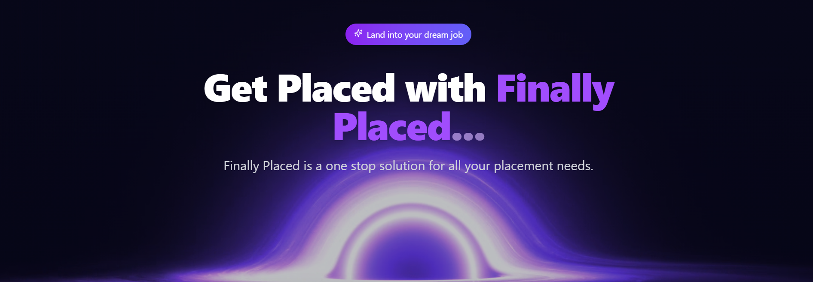
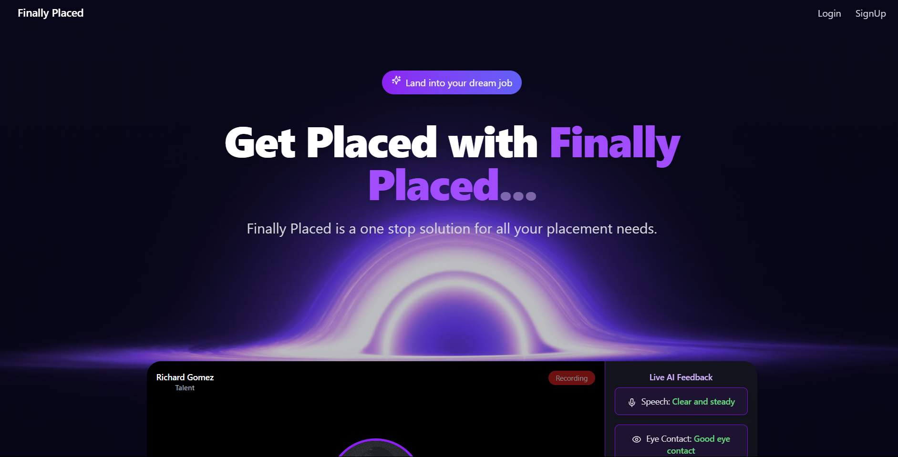
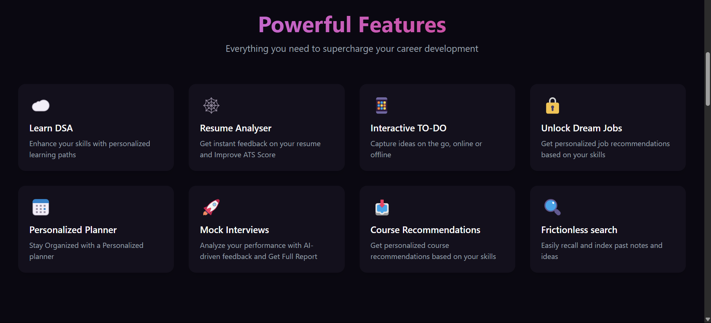
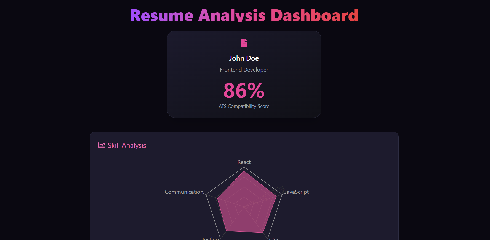
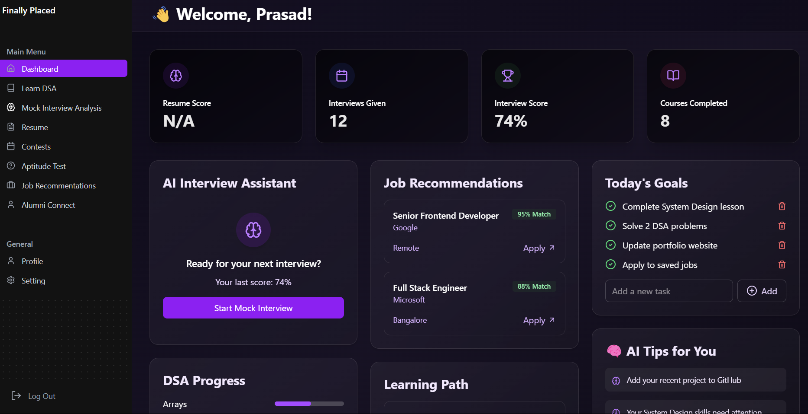
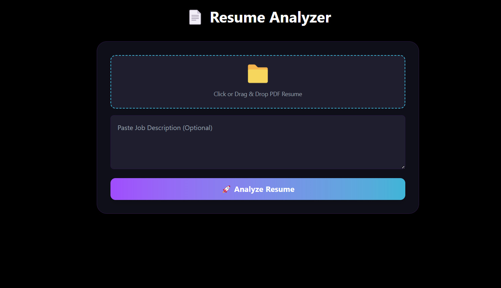
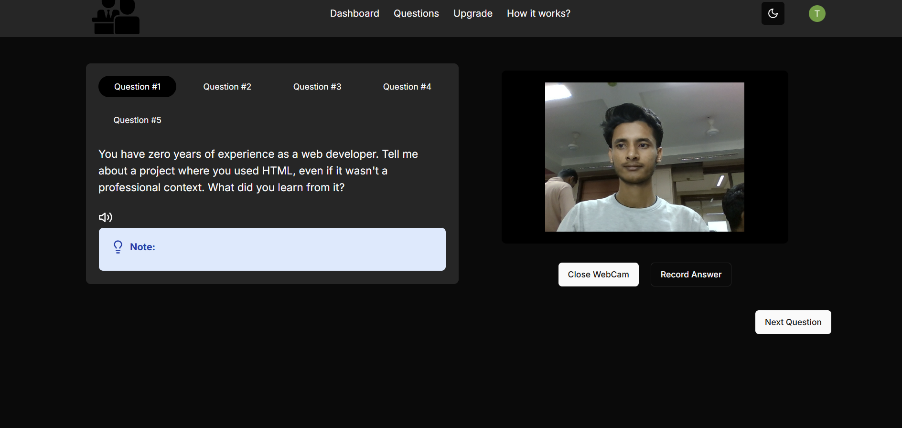
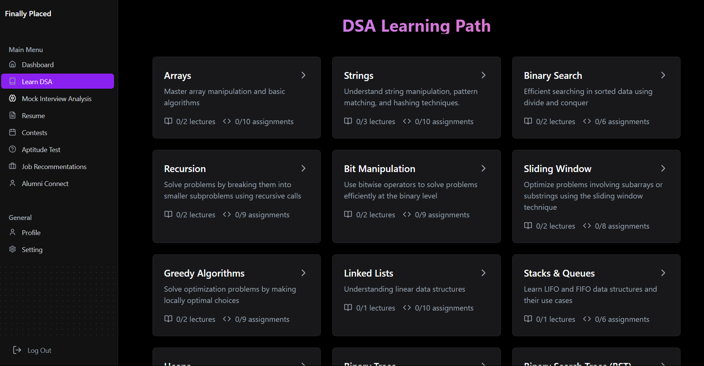
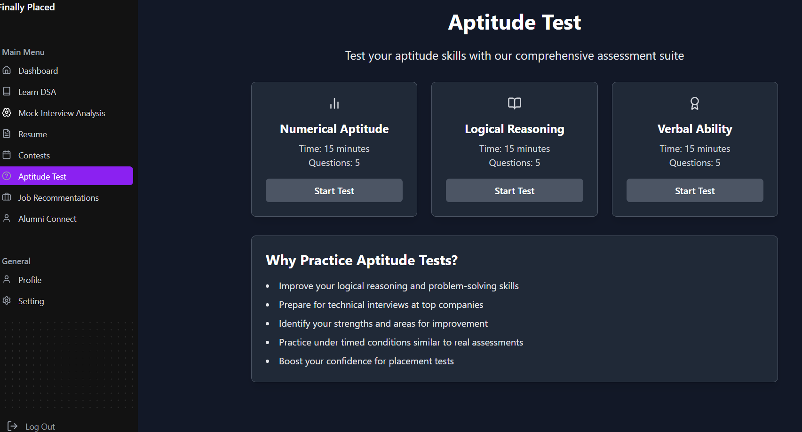
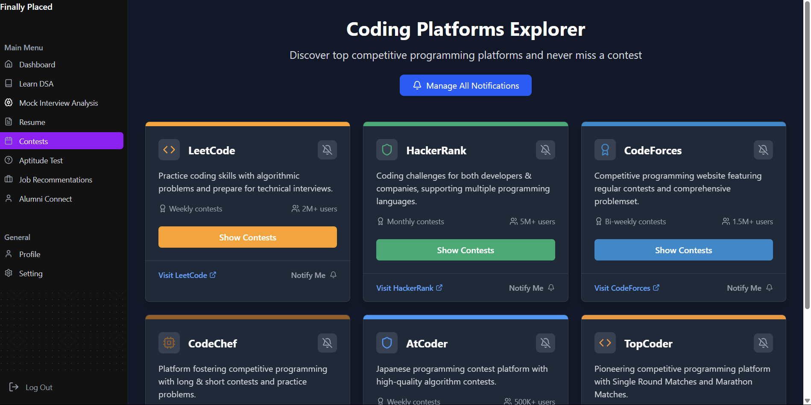

# 💼 getPlaced - AI Powered Placement Assistant



A sleek and personalized career development dashboard built with *React*. Designed to supercharge your job preparation journey, this platform offers a unified interface to manage your resume, track DSA progress, access curated learning resources, and get AI-powered interview feedback.

## ✨ Key Features

| Feature | Description |
|---------|-------------|
| 📊 **Dashboard** | Personalized progress tracking • Daily goals and achievement metrics • Quick access to all platform features |
| 📄 **Resume Analyzer** | Instant ATS compatibility scoring • Skill gap analysis • AI-powered improvement suggestions |
| 🤖 **AI Interview Assistant** | Real-time speech analysis (pace, clarity) • Eye contact and posture tracking • Detailed performance reports • Personalized improvement tips |
| 🧠 **Learning Hub** | Structured DSA learning paths • Progress tracking (lectures/assignments) • Personalized course recommendations |
| 💼 **Career Tools** | Smart job matching algorithm • Application tracking • Company-specific preparation resources |
| 🧪 **Aptitude Training** | Numerical reasoning tests • Logical reasoning exercises • Verbal ability assessments |

## 🖥️ Screenshots
| Home | Features | Resume Page |
|-----------|-----------------|----------------|
|  |  |  |
| **Dashboard** | **Resume Analysis** | **Mock Interview** |
|  |  |  |

| Learning Path | Aptitude Test | Contests |
|---------------|---------------------|---------------|
|  |  |  |

## 🛠️ Tech Stack

| Category | Technologies |
|----------|-------------|
| **Frontend** | React • Tailwind CSS • React Hooks • Chart.js |
| **Backend** | Node.js • Express • MongoDB |
| **AI/ML Components** | OpenAI API • TensorFlow • OpenCV • MediaPipe |
| **APIs** | RapidAPI • Gemini API |


## 🚀 Getting Started

### Option 1: Docker (Recommended) 🐳

The entire platform (Frontend, Node.js API, Python AI/OCR Service, and MongoDB) is containerized and ready to run with Docker Compose.

#### Prerequisites
- [Docker](https://docs.docker.com/get-docker/) (v20+)
- [Docker Compose](https://docs.docker.com/compose/) (v2+)

#### Steps

1. **Clone the repository:**
   ```bash
   git clone https://github.com/Tejas-Santosh-Nalawade/Dev-Clash.git
   cd Dev-Clash
   ```

2. **Configure Environment Variables:**
   Copy the example environment configuration:
   ```bash
   cp .env.example .env
   ```
   Edit `.env` to supply your API keys:
   ```env
   # Database & Auth
   MONGO_URI=mongodb://mongodb:27017/getplaced
   JWT_SECRET=your_jwt_secret

   # AI & External APIs
   GOOGLE_API_KEY=your_gemini_api_key
   RAPIDAPI_KEY=your_rapidapi_key
   ADZUNA_API_ID=your_adzuna_api_id
   ADZUNA_API_KEY=your_adzuna_api_key

   # Frontend API endpoints
   VITE_NODE_API_URL=http://localhost:3000
   VITE_PY_API_URL=http://localhost:8000
   ```

3. **Start All Services:**
   ```bash
   docker compose up --build -d
   ```

4. **Verify Running Services:**
   ```bash
   docker compose ps
   ```

5. **Access the Application:**
   - **Frontend UI:** [http://localhost](http://localhost) (Port 80)
   - **Node.js Backend:** [http://localhost:3000](http://localhost:3000)
   - **Python FastAPI Backend:** [http://localhost:8000](http://localhost:8000) (Interactive Swagger docs at `http://localhost:8000/docs`)
   - **MongoDB:** `localhost:27017`

6. **Stopping the Services:**
   ```bash
   docker compose down
   # To stop and wipe persistent database volumes:
   docker compose down -v
   ```

---

### Option 2: Local Manual Setup 💻

#### Prerequisites
- Node.js (v18+)
- Python (v3.10+) with `tesseract-ocr` & `poppler-utils` installed
- MongoDB instance (Local or MongoDB Atlas)

#### 1. Backend (Node.js)
```bash
cd backend-Node
npm install
# Create backend-Node/.env with MONGO_URI, JWT_SECRET, RAPIDAPI_KEY
npm start
```

#### 2. Backend (Python AI / Resume Analyzer)
```bash
cd backend-Py
python3 -m venv .venv
source .venv/bin/activate
pip install -r requirements.txt uvicorn
# Create backend-Py/.env with GOOGLE_API_KEY, RAPIDAPI_KEY
uvicorn main:app --host 0.0.0.0 --port 8000 --reload
```

#### 3. Frontend (React + Vite)
```bash
cd frontend
npm install
npm run dev
```
Access at `http://localhost:5173`.

---

## 🌟 Key Highlights for Recruiters

### 💡 **Innovation & Impact**
- **AI-Powered Solutions**: Integrated multiple AI APIs for comprehensive career assistance
- **Real-time Analysis**: Live interview feedback with speech and gesture recognition
- **Data-Driven Insights**: Smart resume scoring and personalized improvement suggestions
- **Scalable Architecture**: Modern MERN stack with microservices approach

### 🎯 **Technical Excellence**
- **Modern Tech Stack**: React 19, Node.js, MongoDB, TailwindCSS
- **API Integration**: OpenAI, TensorFlow, MediaPipe, RapidAPI
- **Responsive Design**: Mobile-first approach with sleek UI/UX
- **Performance Optimized**: Efficient state management and data visualization

### 📊 **Problem-Solving Approach**
- **User-Centric Design**: Identified pain points in job preparation journey
- **Comprehensive Solution**: End-to-end platform covering all preparation aspects
- **Real-world Application**: Practical tools that solve actual industry challenges
- **Continuous Learning**: Adaptive content based on user progress

---

## 🛡️ **Security & Performance**
- **JWT Authentication**: Secure user session management
- **Data Privacy**: Compliant with modern privacy standards
- **API Rate Limiting**: Optimized external API usage
- **Error Handling**: Comprehensive error management system

---

## 🚀 **Future Enhancements**
- [ ] Mobile Application (React Native)
- [ ] Advanced Analytics Dashboard
- [ ] Company-specific Interview Prep
- [ ] Peer-to-peer Learning Platform
- [ ] AI-powered Job Matching Algorithm

---

## 👥 **Team & Development**

**Hackathon Team - Dev Clash**

**Team Members:**
- **[@Tejas-Santosh-Nalawade](https://github.com/Tejas-Santosh-Nalawade)** - Tejas Nalawade
- **[@Prasadkandekar](https://github.com/Prasadkandekar)** - Prasad Trimbak Kandekar  
- **[@Asteriskkkk](https://github.com/Asteriskkkk)** - Amit Patil
- **[@Pravinrathod3](https://github.com/Pravinrathod3)** - Pravinsingh Rathod
- **Hitesh Khare**

**Development Timeline**: 24 Hours  
**Team Size**: 5 Members  
**Project Type**: DevClash Hackathon Devcraft / Group Project

---

## 🤝 **Contributing**
We welcome contributions! Please see our [Contributing Guidelines](CONTRIBUTING.md) for details.

1. Fork the repository
2. Create your feature branch (`git checkout -b feature/AmazingFeature`)
3. Commit your changes (`git commit -m 'Add some AmazingFeature'`)
4. Push to the branch (`git push origin feature/AmazingFeature`)
5. Open a Pull Request

---

## 🌟 **Acknowledgments**
- OpenAI for AI integration capabilities
- RapidAPI for job search functionality
- Google's MediaPipe for gesture recognition
- The open-source community for invaluable tools and libraries

---

<div align="center">

**⭐ If this project helped you, please give it a star! ⭐**

**🚀 Ready to transform your career journey? Let's connect!**

</div>
